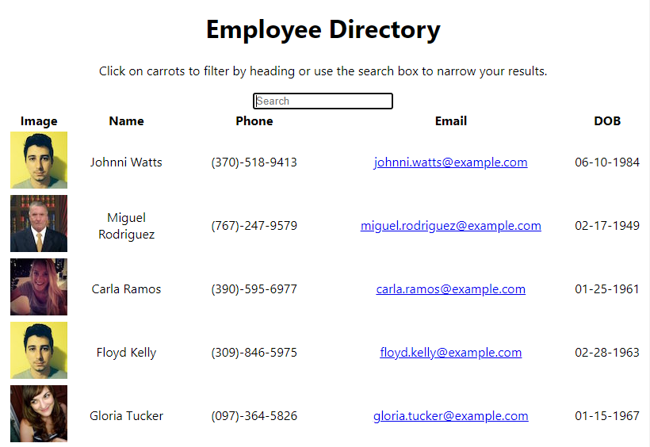

# React-Employee-Directory

## Description
For this homework assignment we will be creating an employee directory with React. In doing this we will help a employee or manager so that they can view non-sensitive data about other employees. We will be filtering employees by name so that employee information is easily attainable. 

## User Story
As a user, I want to be able to view the entire employee directory at once so that I can have quick access to their information.

## Acceptance Criteria
Given a table of random users generated from the [Random User API](https://randomuser.me/), when the user loads the page, a table of employees should render. 
Given when the user can sort employee table by at least one category
Given when the user can filter employee list by at least one property.

## Mock Up

Here is the link to my deployed page: https://marissanancy.github.io/employee-directory-react/